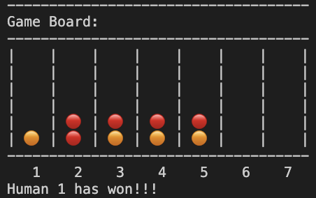

### Connect-4 Game

Implementation of the popular Connect-4 game.

Allows the user to select the number of players and the number of tokens required for a win.

Type '''javac Main.java'''' to compile and '''java Main''' to run.

